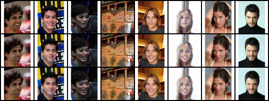
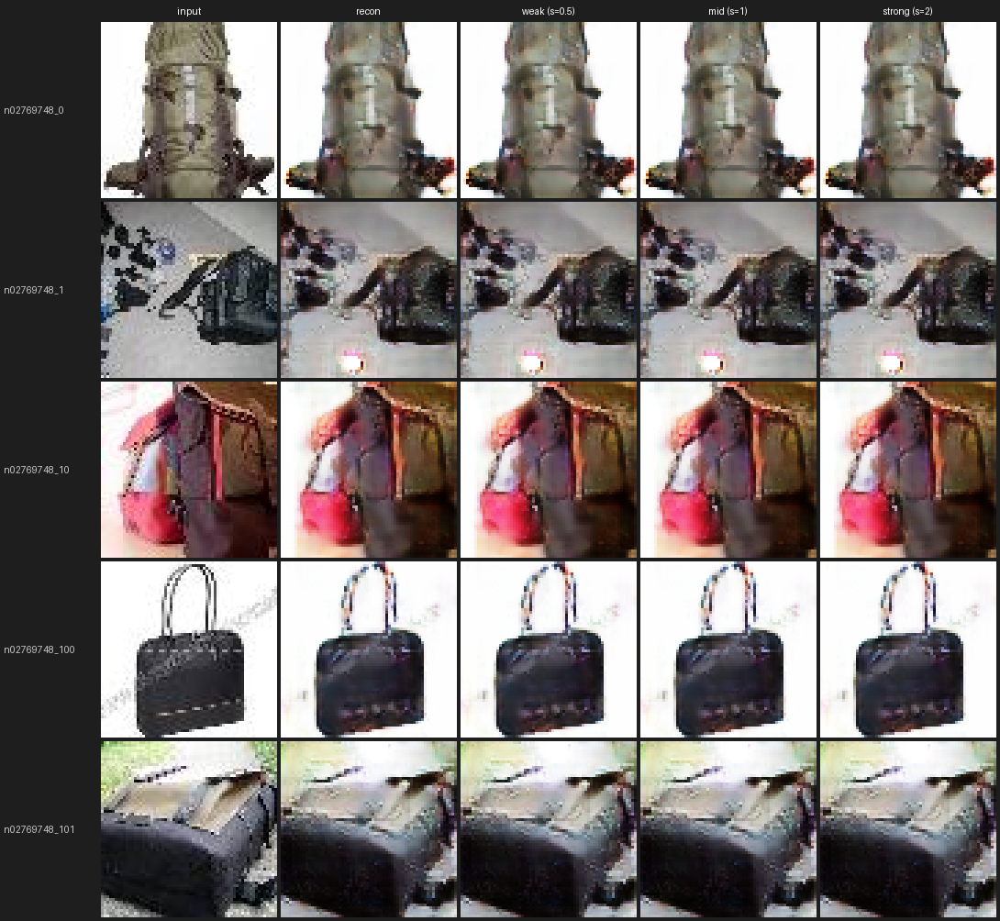

# GANトラック 検証ログ

「ただの物体への笑顔付与」GAN担当([計画書](make_everything_smile_plan.md))の検証記録。
各検証の **条件 → 結果 → 結果の在処** を時系列でまとめる。

- コード: [gan/](../)、各runの厳密な設定は `gan/outputs/<run>/config.json`(学習時に自動保存)
- 結果画像の原本は `gan/outputs/<run>/`(gitignore・再生成可能)。本書には代表画像のみ [docs/assets/gan/](assets/gan/) に複製して掲載
- 環境: RTX 5070 (12GB)、Ubuntu、uv管理(PyTorch cu128)

共通の手法: GANを CelebA(笑顔/中立)＋物体画像で学習し、
潜在空間の **笑顔方向ベクトル**(笑顔群と中立群の潜在平均の差)で物体を編集する。

---

## 検証一覧(サマリ)

| # | run | 解像度 | 潜在 | 主眼 | 結論 |
|---|---|---|---|---|---|
| 1 | smoke64 | 64 | 空間 | 疎通(スモーク) | 物体に方向を足すと謎の物体が出現 |

---

## 1. smoke64 — 疎通スモーク

- **条件**: 64px、空間潜在（8x8x64）、20000 step。データ = CelebA(笑顔/中立)＋ Tiny ImageNet 非生物物体。male/femaleペアを分けて平均を取ってから正規化することでジェンダー成分を軽減。
- **結果**: 人間画像において笑顔方向は機能（口角の上昇、歯の出現）。しかし、**物体に方向を足すと謎の物体が出現する場合があるうえ、入力画像よりぼやける**。
- **在処**: `gan/outputs/smoke64_gan/`

---

## 総括と次の課題

- **達成**: 
- **限界(率直に)**: 
- **次の選択肢**: 