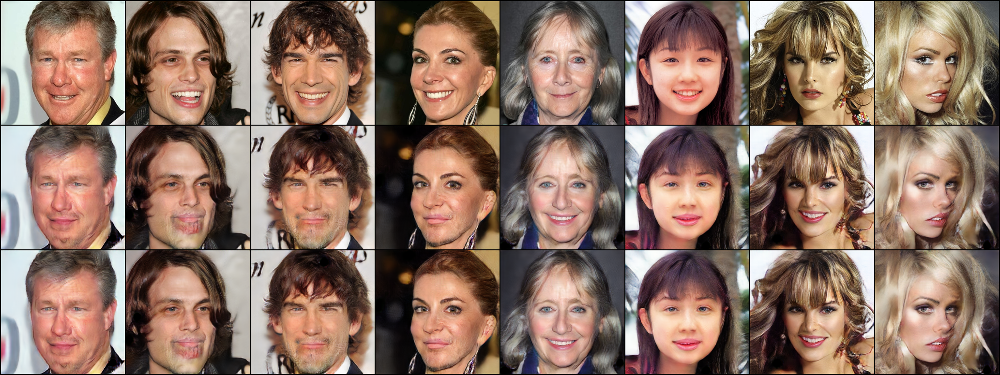
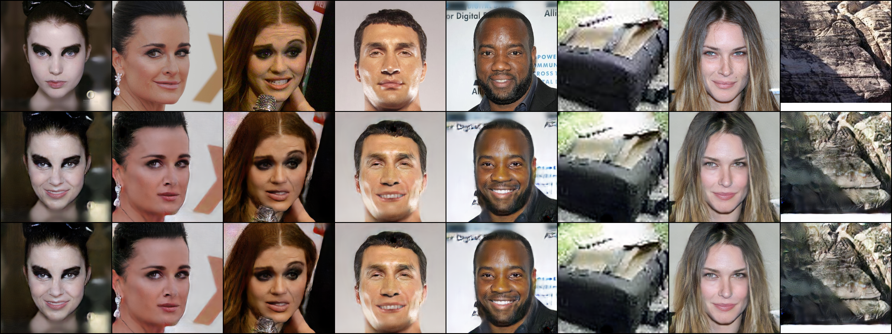
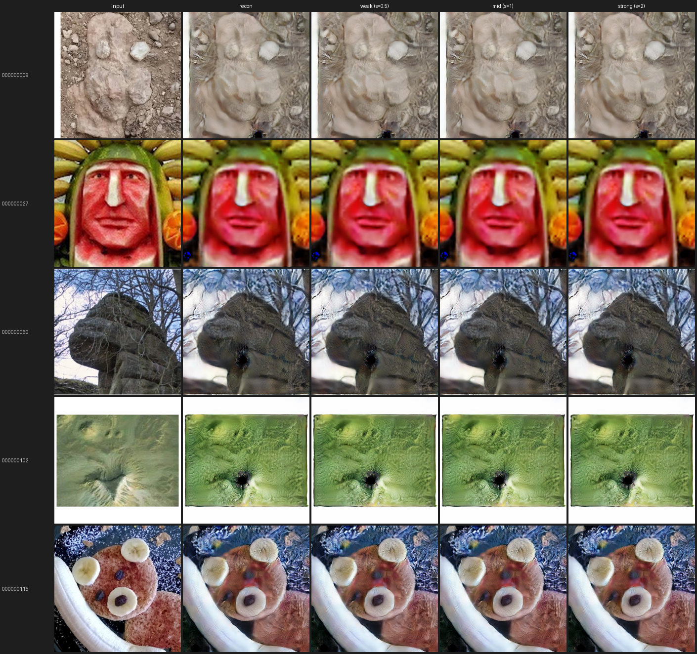
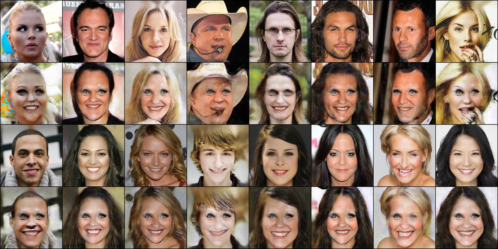
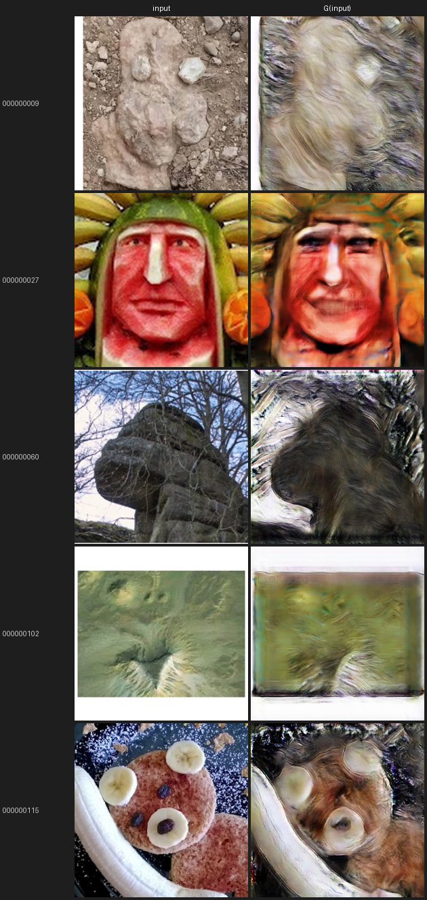

# GANトラック 検証ログ

「ただの物体への笑顔付与」GAN担当([計画書](make_everything_smile_plan.md))の検証記録。
各検証の **条件 → 結果 → 結果の在処** を時系列でまとめる。

- コード: [gan/](../)、各runの厳密な設定は `gan/outputs/<run>/config.json`(学習時に自動保存)
- 結果画像の原本は `gan/outputs/<run>/`(gitignore・再生成可能)。本書には代表画像のみ [docs/assets/gan/](assets/gan/) に複製して掲載
- 環境: RTX 5070 (12GB)、Ubuntu、uv管理(PyTorch cu128)

共通の手法: GANを CelebA(笑顔/中立)＋物体画像で学習し、
潜在空間の **笑顔方向ベクトル**(笑顔群と中立群の潜在平均の差)で物体を編集する。

---

## 検証一覧(サマリ)

| # | run | 解像度 | 主眼 | 結論 |
|---|---|---|---|---|
| 1 | smoke64 | 64px | 疎通(スモーク) | 物体に方向を足すと謎の物体が出現・ぼやける |
| 2 | baseline256 → pareidolia256 | 256px | パレイドリア顔への笑顔転移 | 人間は笑顔化できるが、パレイドリアはぼやけるのみ |
| 3 | dcgan256 | 256px | シンプルなGANでの比較実験 | 人間はアーティファクトつきで笑顔化。パレイドリアは毛並み状テクスチャで原形崩壊 |

---

## 1. smoke64 — 疎通スモーク

- **条件**: 64px、空間潜在（8×8×64）、20,000 step。データ = CelebA（笑顔/中立）＋ Tiny ImageNet 非生物物体。male/femaleペアを分けて平均を取ってから正規化することでジェンダー成分を軽減。
- **結果**: 人間画像において笑顔方向は機能（口角の上昇、歯の出現）。しかし、**物体に方向を足すと謎の物体が出現する場合があるうえ、入力画像よりぼやける**。
- **在処**: `gan/outputs/smoke64_gan/`


---

## 2. baseline256 + pareidolia256 — 2段階学習

### アーキテクチャ（StarGAN-style）

```
入力 x (256×256)
  → Encoder（Strided Conv + InstanceNorm × 4段）
  → Bottleneck（AdaIN 残差ブロック × 6）← smile 強度 s を注入
  → Decoder（Upsample + Conv × 4段）
  → 出力 G(x, s)

smile 強度 s → SmileMLP（Linear × 3）→ AdaIN の γ, β を生成
Discriminator: PatchGAN + smile 回帰ヘッド（顔画像のみ適用）
```

### 損失関数

| 損失 | 重み | 内容 | 適用対象 |
|---|---|---|---|
| adv | 1.0 | 敵対損失（BCE） | 全画像 |
| cls | 1.0 | smile 回帰 MSE | 顔のみ |
| rec | 10.0 | `G(x, label) ≈ x`（L1） | 全画像 |
| cyc | 10.0 | `G(G(x,t),s) ≈ x`（L1） | 顔のみ |
| perc | 0.5 | VGG 知覚損失 | 全画像 |

### Stage 1 — baseline256

- **条件**: CelebA-HQ smile/neutral（各 ~5,000枚）+ 煙オブジェクト、60,000 step、lr_G=2e-4
- **結果**: 人間の顔への笑顔付与が明確に動作（口角上昇・歯の出現）
- **在処**: `gan/outputs/baseline256_gan/`



*上段: 入力 / 中段: G(x, source_label) 再構成 / 下段: G(x, target_label) 変換*

### Stage 2 — pareidolia256（baseline から fine-tune）

- **条件**: baseline256 の重みから継続。FacesInThings crops（happy/neutral）を `smile_dirs`/`neutral_dirs` に追加し `is_face=True` として扱う。15,000 step、lr_G=1e-4（半減）
- **FacesInThings の扱い**: `object_dirs` に入れず `smile_dirs`/`neutral_dirs` に追加することで、D の smile 回帰損失をパレイドリア画像にも適用し、G が neutral↔happy の双方向変換をパレイドリア画像で学習できるよう設計



*上段: 入力 / 中段: 再構成 / 下段: 変換（列1〜5: 人間、列6〜8: パレイドリア/物体）*

### パレイドリア画像への推論結果

推論コマンド（`smilegan.edit`、s=0.5/1.0/2.0）:

```bash
uv run python -m smilegan.edit \
    --ckpt outputs/pareidolia256_gan/ckpt/last.pt \
    --input-dir data/raw/faces_in_things/crops/neutral \
    --out-dir outputs/pareidolia256_gan/edits
```



*列: input / recon / weak(s=0.5) / mid(s=1) / strong(s=2)*

- **結果**: s を変えても出力がほぼ変化しない。再構成（recon）の時点ですでにぼやけている
- **原因**:
  1. **スキップ接続なし** — 16×16 ボトルネックで物体の高周波テクスチャが失われる
  2. **L1 再構成損失** — 学習分布外の画像に対し「平均値」を出力してぼかしが生じる
  3. **D が顔分布を基準** — 「顔らしく見せる」勾配と rec 損失の綱引きで中途半端な出力
  4. **InstanceNorm の分布ミスマッチ** — 顔向けに最適化された正規化が物体特徴を破壊
  5. **happy/neutral クロップが別物体** — 訓練データの「happy=物体A」「neutral=物体B」に対応関係がなく、cls 損失の勾配が意味をなさない

---

## 3. dcgan256 — シンプルな DCGAN による比較実験

### 目的

pareidolia256_gan は AdaIN 条件付け・cycle 損失・smile 回帰という複雑な設計をもつ。**シンプルな DCGAN（条件付けなし）で顔の笑顔を学習した場合、パレイドリア画像にも笑顔が転移するか**を検証する。

### アーキテクチャ（conditions なし）

```
G(x) → y: 条件スカラーなし、Encoder-Decoder のみ
  Encoder: Strided Conv + BN + LeakyReLU × 4段（256→16）
  Decoder: Upsample + Conv + BN + ReLU × 4段（16→256）+ Tanh

D(y) → logit: PatchGAN + SpectralNorm（smile 回帰ヘッドなし）
```

pareidolia256_gan との主な違い:

| | pareidolia256_gan | dcgan256 |
|---|---|---|
| smile 条件付け | `G(x, s)` AdaIN | なし `G(x)` |
| D の smile 回帰 | あり（顔のみ） | なし |
| Cycle 損失 | あり（λ=10） | なし |
| 再構成 | `G(x, label)≈x` | `G(smile)≈smile`（identity） |

### 損失関数

```
D: adv(real_smile=real, G(neutral)=fake)
G: adv + λ_rec × L1(G(smile), smile)   λ_rec=10.0
```

### 学習結果（60,000 step 完走）

- **条件**: CelebA-HQ smile/neutral（各 ~5,000〜7,000枚）、60,000 step、lr_G=2e-4



*行1: neutral 入力 / 行2: G(neutral) / 行3: smile 入力 / 行4: G(smile) 再構成*

- **人間への結果**: G(neutral) で口角の上昇・歯の出現は確認できる。ただし**目の周囲が黒ずむ・顔の輪郭が崩れる**などのアーティファクトが残る（行2）。G(smile) の再構成（行4）は自然な仕上がり
- **アーティファクトの原因**: skip 接続なし・L1 rec 損失なしの adversarial のみでは高周波情報が失われ、Gが「笑顔らしく見える最短経路」として目周りを暗化させる傾向がある

### パレイドリアへの推論結果

```bash
uv run python -m smilegan.dcgan_edit \
    --ckpt outputs/dcgan256/ckpt/last.pt \
    --input-dir data/raw/faces_in_things/crops/neutral \
    --out-dir outputs/dcgan256/edits --limit 5
```



*列: input / G(input)*

- **結果**: 笑顔化は起きず。**毛並み・毛皮状のテクスチャが全面に適用され原形を留めない**
- **原因**: D の学習分布は人間の顔（CelebA-HQ）のみ。G は「D を騙す＝顔らしいテクスチャに変換する」よう最適化されており、パレイドリア入力に対しても顔の表面テクスチャ（皮膚・毛髪）を上書きしてしまう。結果として pareidolia の構造は消え、人間顔の断片に置き換えられる
- **pareidolia256_gan との比較**:

| 観点 | pareidolia256_gan | dcgan256 |
|---|---|---|
| 物体の形状保持 | △ ぼやけるが形状は残る | ✗ 毛並みテクスチャで原形崩壊 |
| 笑顔への変化 | ✗ ほぼ変化なし | ✗ 笑顔ではなく顔テクスチャに変換 |
| 人間顔への笑顔 | ✅ 高品質 | △ 笑顔にはなるがアーティファクトあり |

---

## 総括と次の課題

### 達成

- StarGAN-style モデルで人間の顔への笑顔付与が高品質に動作（256px）
- 2段階学習（CelebA-HQ baseline → FacesInThings fine-tune）のパイプライン構築
- DCGAN を用いたシンプルな比較実験の基盤構築

### 限界

- **パレイドリア画像への笑顔転移は未達**: AdaIN 条件付けが顔分布でしか機能しない。物体は再構成の時点でぼやける
- **FacesInThings の happy/neutral は別物体のため cls 損失が無意味**: 幾何的な対応なし
- **DCGAN はパレイドリアの原形を崩壊させる**: 顔テクスチャへの上書きが起き、物体の構造が消える

### 次の選択肢

1. **latent direction 法**: direction.py で CelebA から笑顔方向ベクトルを算出 → パレイドリア潜在に加算（`--mode latent`）
2. **DCGAN 学習の完走**: 60,000 step 完走後にパレイドリアへ適用し StarGAN と比較
3. **スキップ接続の追加（U-Net 化）**: 物体の高周波テクスチャ保持を改善
