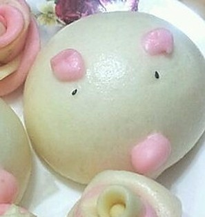
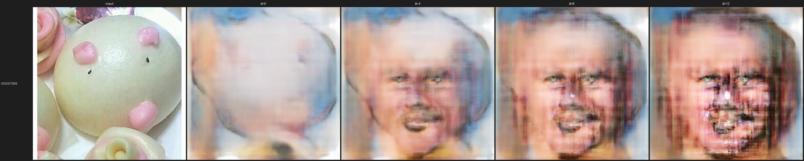
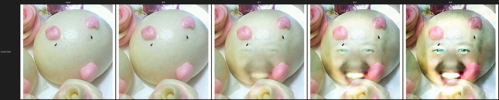
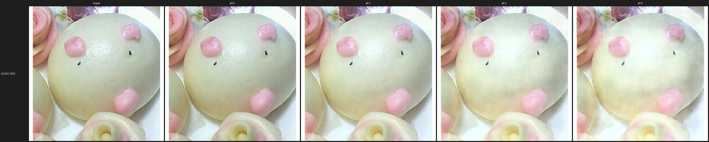

# VAE トラック — 潜在編集による物体への笑顔付与

計画書([docs/make_everything_smile_plan.md](docs/make_everything_smile_plan.md))の VAE 担当分。
「顔ではない普通の物体」に、潜在空間の **笑顔方向ベクトル** を足して笑った顔を宿す。


*左: 入力 → 右: 笑顔方向を強めた出力。物体の色・形を保ったまま口元が笑みになる。*

> 📋 検証の時系列(条件・結果・在処)は **[検証ログ](docs/vae_verification_log.md)**、
> 発表用の内容整理は [docs/vae_presentation_content.md](docs/vae_presentation_content.md)。

## 手法の全体像(実装イメージ)

学習は一切しない。**事前学習済み SD-VAE(`stabilityai/sd-vae-ft-mse`)を凍結**し、
その潜在空間で「笑顔群と中立群の潜在平均の差」= 笑顔方向ベクトル `d` を1本作り、
入力の潜在に係数 α で足すだけ:

```
                 (1) 方向づくり ── build_direction.py
   笑顔画像群 ──encode──▶ z_smile ─┐
   中立画像群 ──encode──▶ z_neutral ┘→ d = normalize(mean(z_smile) − mean(z_neutral))

                 (2) 編集 ── compare_facesinthings.py
   入力物体 x ──encode──▶ z ──[ z + α·σ·d ]──decode──▶ 笑った物体
              (凍結 SD-VAE)   ↑αラダー 0 1 2 3    (凍結 SD-VAE)

                 (3) 評価 ── eval.py(LPIPS / SSIM / CLIP 画像類似)
```

- σ は方向への射影の標準偏差(`proj_std`)。α を方向間で比較可能な単位にする正規化。
- α=0 は素の再構成。**事前学習土台なので α=0 が完全にシャープ**(スクラッチ版はここでボケた)。
- 方向 `d` の学習ソースを差し替えることが +Pareidolia 介入に相当する:
  **CelebA 人間笑顔**(`smile_direction`、人の顔が重なる)vs
  **Faces in Things の happy−neutral**(`fit_direction`、物体のまま表情が happy 化)。
- 編集オプション: `--keep-color`(色ドリフト抑制・推奨)/ `--feature-only`(一律色成分の除去)/
  低α(個体保存優先)/ 2段カスケード(笑顔最優先・人間化と引き換え)。

各ステップの実装は [experiments/pretrained_ae/](experiments/pretrained_ae/) にあり、
コマンド・オプション・各バリエーションの結果は
**[experiments/pretrained_ae/README.md](experiments/pretrained_ae/README.md)** にまとめている。

## クイックスタート

```bash
cd vae
uv sync   # PyTorch は CUDA 12.4 ホイール(pyproject.toml の index 設定)

# 1. データ取得(笑顔の教師 + 評価入力)
uv run scripts/download_celeba.py --source celeba-hq --out data/raw/celeba_hq
uv run scripts/download_faces_in_things.py --out data/raw/faces_in_things

# 2. 笑顔方向を算出(初回に SD-VAE 重み ~335MB を自動DL)
uv run python experiments/pretrained_ae/build_direction.py \
  --pair data/raw/celeba_hq/smile_male   data/raw/celeba_hq/neutral_male \
  --pair data/raw/celeba_hq/smile_female data/raw/celeba_hq/neutral_female \
  --out outputs/pretrained_ae/smile_direction.pt --resolution 512

# 3. 共通 10 ID の物体 crop を αラダーで編集
uv run python experiments/pretrained_ae/compare_facesinthings.py \
  --direction outputs/pretrained_ae/smile_direction.pt \
  --input-dir data/diffusion_compare/inputs --ids experiments/eval_ids.txt \
  --out-dir outputs/pretrained_ae/compare --scales 0 1 2 3 --keep-color
```

`data/` `outputs/` は gitignore 済みで、上記コマンドから再生成できる。

## リポジトリ構成(どこに何があるか)

```
vae/
├── experiments/
│   ├── pretrained_ae/        # ★本編。凍結 SD-VAE の潜在で笑顔方向を操作
│   │   ├── sdvae.py                  #   SD-VAE の load/encode/decode ラッパ(凍結)
│   │   ├── build_direction.py        #   (1) 笑顔方向ベクトルの算出
│   │   ├── compare_facesinthings.py  #   (2) αラダー編集 + 比較シート出力
│   │   ├── cascade_smile.py          #   発展: 顔化→笑顔の2段カスケード
│   │   └── align_crop.py             #   発展: 入力を canonical フレームへアライン
│   ├── eval.py               # (3) 軽量評価(LPIPS/SSIM/CLIP、共通10 ID で全手法比較)
│   └── eval_ids.txt          # 全手法共通の固定評価 ID(diffusion と同一 crop の10枚)
├── src/smilevae/             # 共有コア(slim)
│   ├── data.py               #   白パディング正方形化 + リサイズ(FiT と作法統一)
│   └── viz.py                #   コンタクトシート描画(to_pil / make_sheet)
├── scripts/                  # データ取得(CelebA(-HQ) / Faces in Things / 物体セット)
├── docs/                     # テキストのみ(画像は assets/ へ)
│   ├── make_everything_smile_plan.md   # チーム全体計画 +[実装]注記(計画との差分)
│   ├── vae_verification_log.md         # 検証1〜9の時系列ログ(条件→結果→在処)
│   ├── vae_presentation_content.md     # 発表に入れる VAE 分コンテンツの整理
│   └── slide_design_brief.md           # スライドデッキ作成の依頼書(構成・画像指定)
├── assets/                   # git 管理の掲載画像(下記)
├── old/                      # 変更前のスクラッチ VAE-GAN 一式(アーカイブ、下記)
└── data/ outputs/            # gitignore 済み・再生成可能
```

## 主な結果(共通 10 ID・512px)

同一物体(蒸しパン ID 000007868)での3段変化が要点をすべて含む:

| 段 | 画像 | 内容 |
|---|---|---|
| 入力 |  | Faces in Things のパレイドリア crop |
| ① スクラッチ VAE-GAN |  | 笑顔は付くが **ボケ + 人間の顔に置換** |
| ② 同じ数式・土台を SD-VAE に |  | **α=0 が完全にシャープ**。土台が原因だったと判明 |
| ③ FiT 方向 + 色保持 |  | **物体自身の顔が、元の色・形のまま笑う** |

定量でも同じ結論(物体保存、①→③。全数値は [assets/results/vae_metrics_10img.csv](assets/results/vae_metrics_10img.csv)):

| | LPIPS ↓ | SSIM ↑ | CLIP 画像類似 ↑ |
|---|---|---|---|
| ① スクラッチ VAE-GAN | 0.74 | 0.35 | 0.67 |
| ③ SD-VAE + FiT 方向 + 色保持 | **0.17** | **0.79** | **0.92** |

主な知見:

- **画質の弱点は VAE という手法族ではなく「画像を描く decoder をゼロから学習した」こと。**
  凍結 SD-VAE に載せ替えるだけで解消(Diffusion トラックと同じ土台に揃えた比較が成立)。
- **「物体を残す」↔「笑顔を強くする」はトレードオフ。** 低α+色保持が個体保存の極、
  2段カスケードが強笑顔(人間化)の極。
- **自動の笑顔指標(CLIP-smile)はほぼノイズ**で「人間化」だけを報酬化する。笑顔軸は人手評価が必要。
- 笑顔がフレーム内の固定位置に出るのは**線形潜在編集の原理的限界**
  (入力アラインで緩和はするが口位置への追従はしない)。

全 10 ID の overview シートと各実験の対応は [assets/results/README.md](assets/results/README.md)。

## old/ — 変更前のスクラッチ VAE-GAN(アーカイブ)

Diffusion に土台を揃える前の実装。スクラッチ VAE-GAN の学習コア・本編実験
(`objects/`)・diffusion 比較(`diffusion_compare/`)を凍結保存している。
置き換えの経緯と実行方法は **[old/README.md](old/README.md)**、
当時の代表画像は [assets/old/](assets/old/)。

## assets/ — 掲載画像

`docs/` はテキストのみとし、画像は `assets/` に分離(索引 [assets/README.md](assets/README.md)):

| フォルダ | 中身 |
|---|---|
| [assets/current/](assets/current/) | 現行 SD-VAE 手法の代表作例・発表キービジュアル(`cmp_*`) |
| [assets/old/](assets/old/) | 変更前スクラッチ VAE-GAN の作例 |
| [assets/results/](assets/results/) | 全 ID overview シート + 評価メトリクス CSV |
