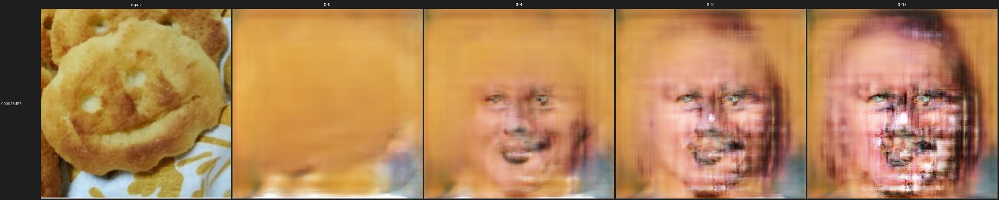
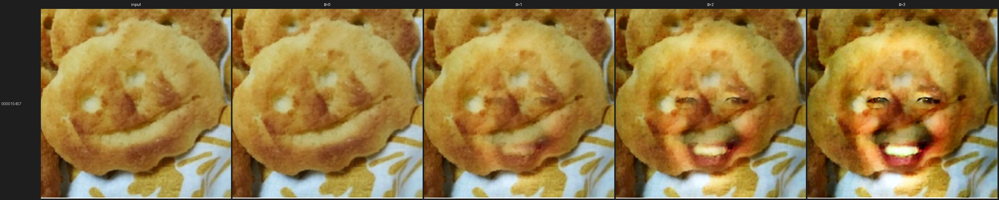
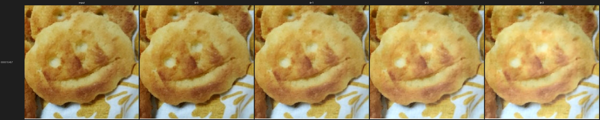
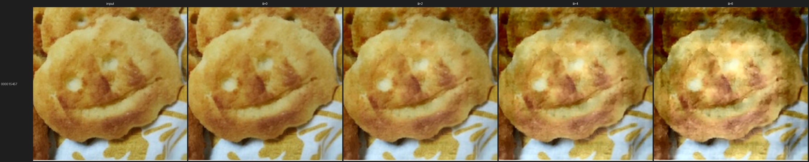

# 発表に入れるべき VAE 関連コンテンツ

「ただの物体への笑顔付与 — VAE / GAN / Diffusion 比較」発表([目次案](make_everything_smile_plan.md))の
**VAE トラック担当分**として、今回の実装([vae/](../)・[検証ログ](vae_verification_log.md))を踏まえ、
7セクションそれぞれに何を入れるべきかを整理する。

> 使い方: 各セクションの「入れるべき内容」を要点、「作例/図」を貼るべき画像、
> 「一言メッセージ」をそのスライドで言い切るべき結論として使う。
> 3手法共通の話は他メンバーと重複しないよう、**VAE 固有の主張**に絞る。

> ⚠️ 更新履歴: 当初はスクラッチ VAE-GAN 単体の物語だったが、Diffusion との比較検証を経て
> 「**画質の弱点は VAE という手法族でなく"画像を描く decoder をゼロから学習した"ことが原因**」
> と判明。事前学習オートエンコーダ(SD-VAE)を土台にする実験([experiments/pretrained_ae/](../experiments/pretrained_ae/))を
> 追加し、Diffusion と同一入力・同一タスク定義で比較できるようにした。本書はその最新版。

---

## VAE トラックの一言サマリ(発表の背骨)

> **VAE の本質は「潜在空間に笑顔方向ベクトルを1本引き、係数 α で物体をその向きへ押す」こと。
> スクラッチ学習の VAE-GAN では「物体が人間に化ける/ぼやける」という弱点が出るが、
> その原因は VAE という手法族ではなく "画像を描く decoder をゼロから小データで学習した" こと。
> 事前学習オートエンコーダ(SD-VAE)を土台にすると、同じ潜在方向演算のまま
> シャープさと物体保存が両立し、FacesInThings の笑顔方向 + 色保持で
> "物体自身の顔を笑わせる" ことができる — これは Diffusion と同じ土俵の結果である。**

この「制御は1本のベクトルで完全に効く。画質・物体保存は"土台"次第」という切り分けが、
GAN / Diffusion との比較で VAE が担う立ち位置。ここを全編通して主張する。

---

## 0. 全体像:2つの VAE 実装を対比で見せる

発表では **同じ潜在方向演算を2つの土台で回した対比**を軸にする。

| 実装 | 画像を描く器(decoder) | 笑顔の効き方 | 位置づけ |
|---|---|---|---|
| **スクラッチ VAE-GAN**([objects](../experiments/objects/) / [diffusion_compare](../experiments/diffusion_compare/)) | ゼロから学習(8GB・約9千枚・512px) | 効くがボケる/人間に化ける | VAE 単体の素の実力・弱点の露呈 |
| **事前学習 SD-VAE 土台**([pretrained_ae](../experiments/pretrained_ae/)) | 事前学習・凍結(`sd-vae-ft-mse`) | シャープ+物体保存で笑う | 弱点の原因が"土台"だと実証、Diffusion と同じ土俵 |

**この2列の差 = 事前学習の有無**。Diffusion がシャープなのも同じ理由(下記)なので、
「VAE vs Diffusion」ではなく「**事前学習の土台があるか**」が効いている、と示せるのが今回の主結果。

---

## 1. 背景・目的(1分)

**入れるべき VAE 視点:**
- 3手法比較における VAE の役割 = **「潜在空間の線形操作で属性を付与する」代表**。
  「潜在空間に属性方向が線形に埋まっている」という仮説を最も素朴に検証できるのが VAE。
- 研究上の問い(編集可能性・制御性)に対する VAE の仮説を1文で:
  **「笑顔の強さは潜在ベクトルへの係数 α ひとつで連続制御できる(=制御性は高い)。
  画質(自然さ)は VAE 固有の弱点に見えるが、実は"画像を描く器"の質で決まる」**。

**一言メッセージ:** VAE は「制御は透明。画質は土台次第」を最も純粋に見せる基準点。

---

## 2. タスク設定(1分)

**入れるべき VAE 視点(共通設定の中で VAE 固有の制約):**
- 入力: 物体/パレイドリア画像。出力: 笑顔が宿った同一物体。
- **ペアデータ無し → 教師あり変換は不可** という制約が、VAE で「潜在方向ベクトル」という
  unpaired なアプローチを選んだ理由(計画 §0.1)。
- 笑顔概念は CelebA-HQ `Smiling` から供給(3手法共通)。VAE ではこれを
  **潜在平均の差**として抽出する。
- **タスク定義の明確化(重要・Diffusion との整合)**: 「物体に人の顔を重ねる」のではなく
  **「物体自身の顔(パレイドリア)を happy にする」**。そのため笑顔方向は
  CelebA(人間)だけでなく **FacesInThings の neutral→happy** からも作る(→ §5)。
  これは Diffusion の pareidria policy(FacesInThings neutral→happy を学習)と同じ狙い。

**一言メッセージ:** 「ペアが無い」制約が潜在方向編集を呼び込み、
「物体自身を笑わせる」定義が笑顔ソースをパレイドリア・ドメインへ導く。

---

## 3. 手法の概要(1.5分・VAE 担当の中心スライド)

**入れるべき内容(1枚で最小限に):**

1. **笑顔付与 = 潜在空間の「笑顔方向ベクトル」**(このスライドの主役の図)。
   ```
   笑顔方向 d = normalize( mean( z(笑顔) ) − mean( z(中立) ) )
   編集       z' = z + α · (投影std) · d  →  decode(z')
   ```
   - α が笑顔強度(連続制御)。強度を **潜在投影の標準偏差単位**で正規化し、意味を揃える。
   - これは DCGAN 由来の潜在ベクトル演算で、**Diffusion の Concept Slider と同型の発想**。

2. **"土台" を2通りで示す(今回の主軸):**
   - **(A) スクラッチ VAE-GAN**(Larsen et al. 2016): encoder/decoder/判別器をゼロから学習。
     `KL + 判別器特徴量再構成 + ピクセルL1 + VGG知覚損失 + 敵対損失`。潜在は空間マップ(16×16×64)。
   - **(B) 事前学習 SD-VAE 土台**: `stabilityai/sd-vae-ft-mse` を**凍結**して encoder/decoder に使い、
     その潜在(4×64×64)で同じ方向演算をするだけ。**学習は方向ベクトル算出のみ**。

3. **他手法との対比(1行ずつ):**
   - GAN = ドメイン変換 / AU 条件付け。
   - **Diffusion = 事前学習 IP2P に LoRA を少し足し、"make the face smile" の画像条件つき編集**
     (画像を描く VAE は事前学習・凍結)。
   - VAE の特徴 = **学習後に方向ベクトル1本で、再学習不要・強度連続制御**。

**作例/図:**
- 顔での笑顔方向の効き(サニティ): [v3_faces_sanity.jpg](assets/vae/old/v3_faces_sanity.jpg)
  → 「方向ベクトルは顔でちゃんと笑顔を作れる」ことをまず示す。

**一言メッセージ:** 編集はベクトル1本・強度は α で無段階。あとは"土台"の質が画質を決める。

---

## 4. 実験設定(1分)

**入れるべき VAE 視点:**
- **スクラッチ VAE-GAN**: CelebA-HQ(笑顔/中立 × 男女 各1000)+ 非生物物体(Imagenette 8クラス)。
  +Pareidolia 条件は Faces in Things(happy)を追加(計画 §2.3、学習データだけ変える)。
- **事前学習 SD-VAE 土台**: 学習不要(凍結)。笑顔方向のみ CelebA-HQ ペア(`smile_direction`)か
  FacesInThings neutral→happy(`fit_direction`)から算出。
- **Diffusion との比較を"同一土俵"化(今回追加):**
  - 入力 = Diffusion が使ったのと **同一の FacesInThings 顔 box crop・同一 ID**(共通10枚、
    [eval_ids.txt](../experiments/diffusion_compare/eval_ids.txt))。
  - 出力形式も Diffusion に合わせる(`<id>_compare.png` / `<id>_smile.png`)。
- 属性操作の具体手段(VAE 固有):
  - スクラッチでは **男女別に方向を計算して平均**(CelebA `Smiling` の性別もつれ対策)。
  - 強度 α は std 単位(スクラッチ物体は 4〜12、SD-VAE 土台は 1〜3 が目安)。
- 実行環境: RTX 3070 Ti (8GB) / WSL2。
- 定量評価指標(3手法共通): FID/KID(FiT happy 基準)、笑顔分類器/AU12、
  LPIPS/SSIM(物体保存)、パレイドリア検出器。人手 2AFC が金標準。

**一言メッセージ:** 差が出るのは「土台」と「笑顔ソースのドメイン」だけ、を担保した設計。

---

## 5. 結果(2〜3分・VAE の山場)

**「素朴にやると失敗 → 原因は土台 → 土台を替えて Diffusion と同じ土俵へ」** という物語で見せる。

### 幕1: スクラッチ VAE-GAN の素朴な潜在編集は失敗する
- **失敗A: 物体が人間の顔に化ける** — グローバル潜在(v2)。
  作例: [v2_backpack_collapse.jpg](assets/vae/old/v2_backpack_collapse.jpg)
- **失敗B: 性別のもつれ**(笑顔強化で女性化)。→ **男女別方向**でキャンセル。
- → **空間潜在**で物体の構図・色を保持(v3)。強度で「物体のまま→顔がうっすら→顔が支配的」と遷移。
  作例: [v3_icecream.jpg](assets/vae/old/v3_icecream.jpg)

### 幕2: Diffusion と同一入力で回すと「人間化」がはっきり出る
- スクラッチ VAE-GAN を Diffusion と同じ FacesInThings crop で編集すると、
  α を上げると **物体 → 人間の笑顔が支配的** に(顔枠 crop なので早く人間化)。
  作例(ワッフル、列 = input | α=0 | α=4 | α=8 | α=12):
  [cmp_scratch_humanize.jpg](assets/vae/cmp_scratch_humanize.jpg)

  
- **Diffusion は同じ入力で「物体の顔そのものを笑わせる」**(人間化しない)。
  → この差が「なぜ VAE は不自然に見えるか」の出発点。

### 幕3: 原因の切り分け — 事前学習 decoder を土台にする(今回の主結果)
- スクラッチの弱点(ボケ/人間化)は **decoder をゼロから小データ学習したこと**が原因、という仮説を検証。
- **事前学習 SD-VAE を土台**にし、同じ潜在方向演算を回すと:
  - **α=0(再構成)が完全にシャープ**。物体のテクスチャ・輪郭・色を忠実に保持。
  - 物体を保ったまま笑顔が宿る。
  作例(同じワッフル、SD-VAE 土台。α=0 のシャープさに注目):
  [cmp_pretrained_sharp.jpg](assets/vae/cmp_pretrained_sharp.jpg)

  
- → **「画質の弱点は VAE 手法族でなく土台の問題」を実証**。Diffusion がシャープなのも同じ理由
  (Diffusion も画像を描く VAE は事前学習・凍結)。

### 幕4: タスク定義を Diffusion に揃える — 「物体自身の顔を笑わせる」
- 笑顔ソースを **CelebA(人間)から FacesInThings neutral→happy に切替**(Diffusion と同ドメイン)。
  → 人の顔を重ねるのでなく、**物体自身の口が笑みのカーブ**になる。
- 残課題「暖色ドリフト」(一律ベクトル加算の副作用)を **色保持(`--keep-color`)** で除去。
  → **物体は元の色・形のまま、自分の顔で笑う**。ワッフル/ポテト/蒸しパンで口角が上がる。
  作例(FiT 方向 + 色保持、列 = input | α=0 | α=1 | α=2 | α=3):
  [ワッフル](assets/vae/cmp_object_smile_waffle.jpg) /
  [ポテト](assets/vae/cmp_object_smile_potato.jpg) /
  [蒸しパン](assets/vae/cmp_object_smile_bun.jpg)。
  発表キービジュアル(ワッフルの明確な笑み): [cmp_object_smile_keyvis.jpg](assets/vae/cmp_object_smile_keyvis.jpg)

  
  

### 参考: スクラッチ版の別解 — ピクセル空間ブレンド(単一・大写し物体)
- スクラッチ VAE-GAN でも `--blend`(`元画像 + 目口マスク × (decode(z+d)−decode(z))`)で
  物体のシャープな画素を保ち笑顔差分だけ重ねると、単一果物で笑顔が宿る。
  作例: [blend_gas_pump.jpg](assets/vae/old/blend_gas_pump.jpg) /
  [fruit_lemons.jpg](assets/vae/old/fruit_lemons.jpg)
- ただし本命は幕3・幕4(事前学習土台)。ブレンドは「土台を替えられない時の回避策」と位置づける。

**一言メッセージ:** 制御(強度・方向)は完全に効く。画質と物体保存は"土台"で決まり、
事前学習 AE を土台にすれば Diffusion と同じ土俵で「物体自身を笑わせる」ことができた。

---

## 6. 考察(1分)

**入れるべき VAE 視点(なぜ差が出たか・公平な位置づけ):**
- **制御性 ◎:** 潜在の線形方向 + 係数 α で、強度も方向(CelebA / FiT)も無段階・再学習不要。
  3手法中もっとも「編集軸が明示的で解釈可能」。
- **画質・物体保存は"土台"次第:**
  - スクラッチ VAE-GAN → △(ボケ・人間化)。**VAE 固有の限界に見えるが実は decoder の学習量の問題**。
  - 事前学習 SD-VAE 土台 → ○〜◎(シャープ・物体保存)。
- **VAE vs Diffusion の差の本質(発表で言い切る):**
  1. **事前学習の土台の有無**が支配的(手法族の差ではない)。同一 SD 系 VAE を土台にすると VAE も鮮明。
  2. **編集エンジンの違い**: VAE = 潜在に**一律の線形ベクトル**を足す(学習なし)。
     Diffusion = **学習した LoRA**による**画像条件つきの空間適応編集**(50step)。
     → VAE は色ドリフト等が出て後処理(色保持)が要る。Diffusion は画像条件つきゆえ不要。
     これは「グローバル線形演算 vs 学習した条件付き編集」という**消えない手法差**。

  | 観点 | スクラッチ VAE-GAN | 事前学習 AE 土台 | 理由 |
  |---|---|---|---|
  | 制御性 | ◎ | ◎ | 潜在方向1本 + α、再学習不要 |
  | 物体保存 | ○(要工夫) | ◎ | 事前学習 decoder が忠実 |
  | 自然さ/画質 | △ | ○〜◎ | decoder の事前学習の有無 |
  | 実装/計算コスト | ○(3h 学習) | ◎(学習不要) | 凍結 AE + 方向算出のみ |

**一言メッセージ:** VAE は「軽くて制御が透明」。画質は手法族の宿命でなく"土台"の問題で、
事前学習 AE を土台にすれば埋まる。残る本質差は「線形演算 vs 学習した条件付き編集」。

---

## 7. まとめ・今後(0.5分)

**VAE トラックの結論(どの用途に向くか):**
- **向く:** 強度・方向を細かく制御したい/軽量に回したい/編集軸を解釈したい用途。
  **事前学習 AE を土台にすれば** パレイドリア物体を「自分の顔で」自然に笑わせられる。
- **不向き(素の線形演算の限界):** 画像条件つきの精緻な局所編集(→ Diffusion の LoRA が上)。

**今後:**
1. `fit_direction` の色ドリフトのさらなる抑制(口領域限定・feature-only の併用)。
2. Diffusion と **同一 256px・paste-back(元写真へ貼り戻し)** まで揃えて公平性を上げる。
3. 笑顔分類器 / AU12 で before/after を **定量採点**し、3手法を同一指標で比較。

**一言メッセージ:** 「1本のベクトルで笑わせられる」制御性は VAE の存在意義。
画質は"土台"で埋まると示せた。残る宿題は「線形演算 vs 条件付き編集」という手法特性そのもの。

---

## 付録: VAE ↔ Diffusion 実装の対応と差(公平性チェック)

Diffusion 実装(`diffusion/scripts/{train,infer}.py`, `build_pairs_pareidria.py` を確認):
IP2P(`timbrooks/instruct-pix2pix`)を土台に、**VAE・text encoder・U-Net を凍結**して
attention に **LoRA rank8** を足し、FacesInThings neutral→happy(+CelebA)を ε-MSE で学習。
推論は `"make the face smile"` の**画像条件つき編集**(50step, image_guidance_scale=1.5)。

| 段階 | Diffusion | VAE(事前学習AE 版) | 揃い |
|---|---|---|---|
| 入力 crop・評価ID | FacesInThings 顔 box crop・共通ID | 同一 crop・同一ID | ✅ |
| 笑顔の学習ドメイン | FacesInThings neutral→happy(+CelebA) | FacesInThings happy−neutral(`fit_direction`) | ✅ |
| 画像を描く器 | 凍結の事前学習 SD-VAE(IP2P 同梱) | 凍結の事前学習 SD-VAE(`sd-vae-ft-mse`) | ✅(系統同じ) |
| タスク定義 | 物体の顔自体を happy に | 物体の顔自体を happy に(色保持) | ✅ |
| **編集エンジン** | **学習した LoRA**の画像条件つき50step編集 | **線形の平均差ベクトル**を一律加算・1回 decode | ❌(本質差) |
| 出力の paste-back | あり(元写真へ貼戻し) | 未対応(crop 単体) | ▲ |
| 解像度 | 256px | 512px | ▲(要統一) |

- **✅ = 比較の土俵として揃った軸**(入力・ドメイン・土台・タスク定義)。
- **❌ = 手法差そのもの**(線形演算 vs 学習した条件付き編集)。消さず"比較結果"として提示。
- **▲ = 公平性のため揃える余地**(256px 化・paste-back)。発表前に対応すると尚良い。

---

## 付録: スライドに載せる画像早見表

| 使いどころ | 画像 | 見せたいこと |
|---|---|---|
| 手法概要(方向が効く証拠) | [v3_faces_sanity.jpg](assets/vae/old/v3_faces_sanity.jpg) | 顔で笑顔方向が機能 |
| 失敗A(物体崩壊) | [v2_backpack_collapse.jpg](assets/vae/old/v2_backpack_collapse.jpg) | グローバル潜在の限界 |
| 対策(強度遷移) | [v3_icecream.jpg](assets/vae/old/v3_icecream.jpg) | α で連続制御 |
| 幕2: 人間化(スクラッチ) | [cmp_scratch_humanize.jpg](assets/vae/cmp_scratch_humanize.jpg) | 同一入力で人間に化ける |
| 幕3: 事前学習土台で鮮明化 | [cmp_pretrained_sharp.jpg](assets/vae/cmp_pretrained_sharp.jpg) | 弱点は土台の問題 |
| 幕4: 物体自身が笑う(色保持) | [cmp_object_smile_waffle.jpg](assets/vae/cmp_object_smile_waffle.jpg) / [potato](assets/vae/cmp_object_smile_potato.jpg) / [bun](assets/vae/cmp_object_smile_bun.jpg) | Diffusion と同じ土俵 |
| 幕4: キービジュアル | [cmp_object_smile_keyvis.jpg](assets/vae/cmp_object_smile_keyvis.jpg) | ワッフルの明確な笑み |
| 参考: ブレンド/果物 | [blend_gas_pump.jpg](assets/vae/old/blend_gas_pump.jpg) / [fruit_lemons.jpg](assets/vae/old/fruit_lemons.jpg) | スクラッチ版の別解 |

> 幕2〜幕4 の画像は今回の新規実験の代表フレーム(`vae/outputs/` の各 `<id>_compare.png` から
> `docs/assets/vae/` へ書き出したもの)。旧スクラッチ手法の作例は `assets/vae/old/` に格納。

## 付録: 発表で必ず言い切る3点

1. **手法:** 潜在に笑顔方向ベクトルを1本引き、α で強度を無段階制御する(DCGAN/Concept Slider と同型)。
2. **主結果:** VAE の画質の弱点は手法族でなく **"画像を描く decoder をゼロから学習した"** ことが原因。
   **事前学習 SD-VAE を土台**にすると、同じ演算で **シャープ + 物体保存**が両立し、
   FacesInThings 方向 + 色保持で **物体自身の顔を笑わせられた**(= Diffusion と同じ土俵)。
3. **手法差の核:** 残る差は「VAE=線形の潜在演算(学習なし・軽量・透明)」 vs
   「Diffusion=学習した条件付き編集(精緻・重い)」。VAE は制御性と軽さで存在意義を持つ。
