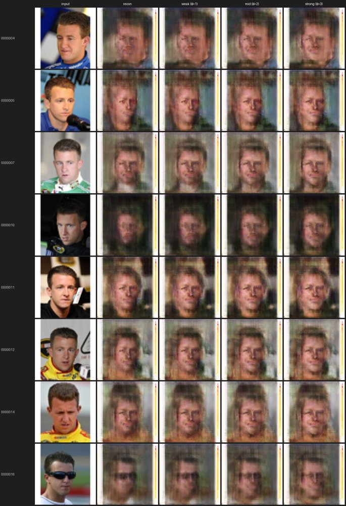
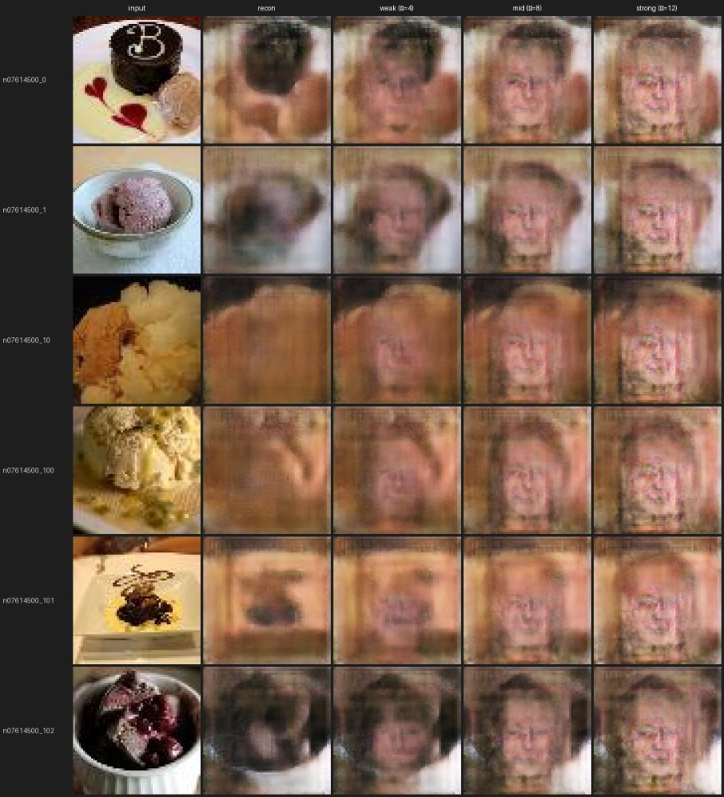
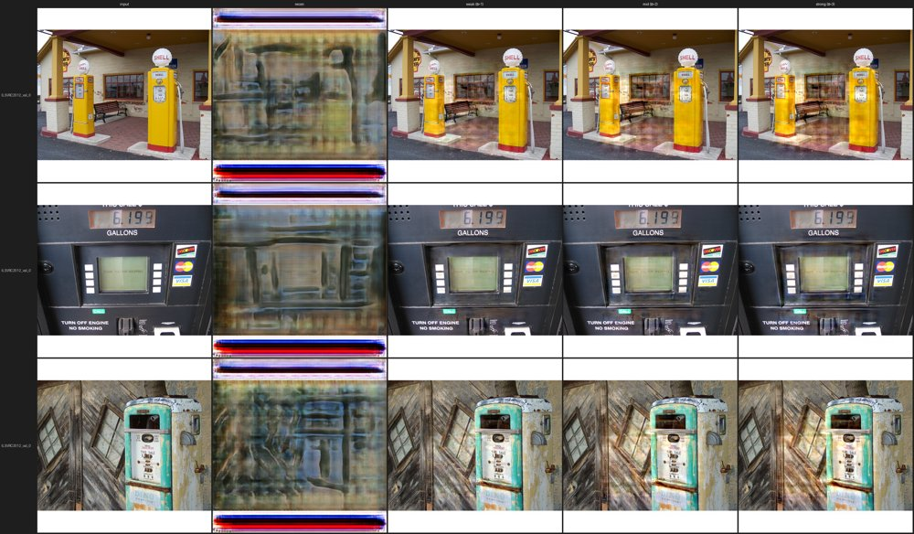
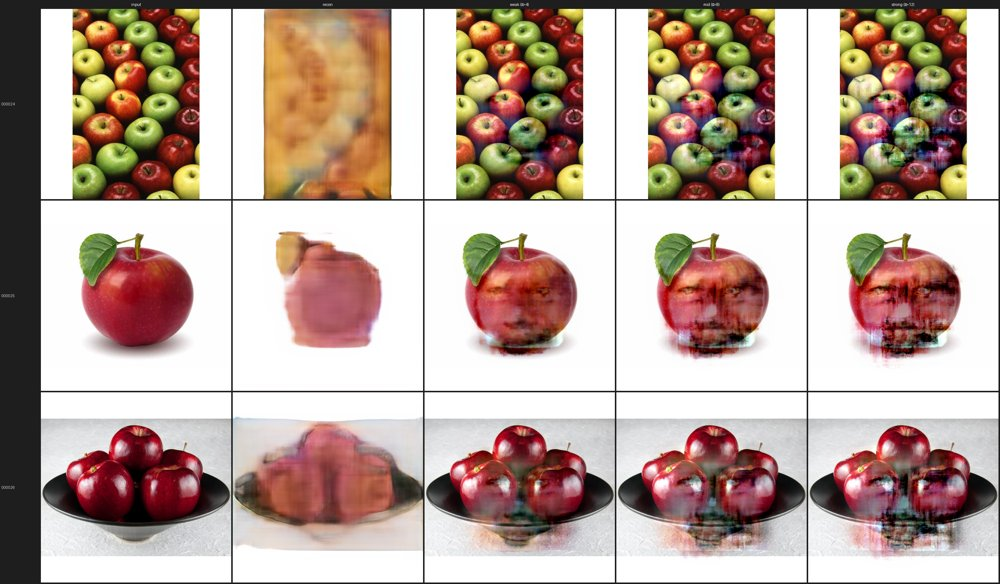

# VAEトラック 検証ログ

「ただの物体への笑顔付与」VAE担当([計画書](make_everything_smile_plan.md))の検証記録。
各検証の **条件 → 結果 → 結果の在処** を時系列でまとめる。

- コード: [vae/](../)、各runの厳密な設定は `vae/outputs/<run>/config.json`(学習時に自動保存)
- 結果画像の原本は `vae/outputs/<run>/`(gitignore・再生成可能)。本書には代表画像のみ [docs/assets/vae/](assets/vae/) に複製して掲載
- 環境: RTX 3070 Ti (8GB)、WSL2、uv管理(PyTorch cu124)

共通の手法: VAE-GAN(Larsen et al. 2016)を CelebA(笑顔/中立)＋物体画像で学習し、
潜在空間の **笑顔方向ベクトル**(笑顔群と中立群の潜在平均の差)で物体を編集する。

---

## 検証一覧(サマリ)

| # | run | 解像度 | 潜在 | 主眼 | 結論 |
|---|---|---|---|---|---|
| 1 | smoke64 | 64 | グローバル | 疎通(スモーク) | データ汚染で失敗→修正 |
| 2 | smoke64_v2 | 64 | グローバル256次元 | 笑顔編集の成立 | 編集は効くが物体が顔に崩壊 |
| 3 | smoke64_v3 | 64 | 空間8×8×64 | 物体保存・性別もつれ | 物体保存OK・男女別方向で改善 |
| 4 | hq512 (Baseline) | 512 | 空間16×16×64 | 高解像度・画質 | 顔は可・物体はぼやけ＆スケール不一致 |
| 5 | pareidolia512 (+Pareidolia) | 512 | 空間16×16×64 | FiT追加学習 | FiT方向は作れるが再構成精度が限界 |
| 6 | blend_demo | 512 | — | 物体保存(ピクセル合成) | 物体をシャープに保てる |
| 7 | fruit_demo | 512 | — | 単一物体への憑依 | 単一果物で笑顔が宿る(本命作例) |

---

## 1. smoke64 — 疎通スモーク(失敗→原因特定)

- **条件**: 64px、グローバル潜在、4000 step。データ = CelebA(笑顔/中立)＋ Tiny ImageNet 非生物物体。
- **結果**: 出力が雑なブロブにしかならず。原因は **Tiny ImageNet 展開キャッシュが物体フォルダ内に残り、全200クラス12万枚(動物含む)が学習に再帰混入** していたこと。意図した7千枚ではなかった。
- **在処**: `vae/outputs/smoke64/`(汚染下の旧結果)。修正はコミット `4afebe2`(キャッシュを `data/raw/_cache/` に分離)。

## 2. smoke64_v2 — 笑顔編集の成立とグローバル潜在の限界

- **条件**: 64px、グローバル潜在 z=256、20000 step、クリーンな7千枚。D学習率半減＋ラベルスムージングで安定化。
- **結果**: 笑顔方向は機能(顔で口角・歯が変化)。しかし **物体に方向を足すと物体が人間の顔そのものに置換**(物体保存ゼロ)、笑顔強化で **女性化**(性別もつれ)。
- **在処**: 顔サニティ [v2_faces_sanity.jpg](assets/vae/v2_faces_sanity.jpg) / 物体崩壊例 [v2_backpack_collapse.jpg](assets/vae/v2_backpack_collapse.jpg)。原本 `vae/outputs/smoke64_v2/edits/`。

## 3. smoke64_v3 — 空間潜在＋男女別方向

- **条件**: 64px、**空間潜在 8×8×64**、20000 step。CelebAを **笑顔/中立 × 男/女** の4分割でDLし、男女別に方向を計算して平均(性別もつれ対策)。設定: [vae/configs/smoke64.yaml](../configs/smoke64.yaml)。
- **結果**: 物体の構図・色が **保持されたまま** 編集できるようになった(グローバル潜在の崩壊が解消)。物体は顔より強いα が必要(顔1〜3 / 物体4〜12)で、αを上げると「物体のまま→顔がうっすら宿る→顔が支配的」と遷移。
- **在処**: 顔 [v3_faces_sanity.jpg](assets/vae/v3_faces_sanity.jpg) / アイス強度振り [v3_icecream.jpg](assets/vae/v3_icecream.jpg)。原本 `vae/outputs/smoke64_v3/edits/`。コミット `d005d6b`。

## 4. hq512 — 512px Baseline

- **条件**: **512px**、空間潜在 16×16×64、30000 step(189分)。AMP(混合精度)＋VGG perceptual loss、KL重み0.5。データ = CelebA-HQ(笑顔/中立×男女 各1000)＋ Imagenette 非生物8クラス。設定: [vae/configs/hq512.yaml](../configs/hq512.yaml)。
- **結果**: 顔の笑顔方向は512pxでも機能。一方 **物体はぼやけ、出てくる顔が物体とスケール不一致**(人間スケールの顔が貼り付く)、**輪郭まで一緒に乗る**。スクラッチVAE-GANを512px・約9千枚で学習する画質の天井に近い。
- **在処**: スケール不一致・輪郭リーク例 [hq512_golf_scale_contour.jpg](assets/vae/hq512_golf_scale_contour.jpg)。原本 `vae/outputs/hq512/edits/`。コミット `9dc30f0`。

## 5. pareidolia512 — +Pareidolia(Faces in Things 追加)

- **条件**: hq512から **微調整(warm-start)**、15000 step(102分)。Baselineデータ ＋ **Faces in Things の happy サブセット(1216枚)を4回オーバーサンプル(約35%)**。設定: [vae/configs/pareidolia512.yaml](../configs/pareidolia512.yaml)。
- **狙いと知見**: FiTを学習に入れ、編集方向も **`FiT-happy − 物体`** から作ると、「人間の顔」ではなく「顔に見える物体」へ押せる(スケール・輪郭が物体側に揃う)。
- **結果**: FiT方向は作れるが、**FiTは現モデルにとって学習量不足で再構成が崩れる**([hq512_fit_recon_ood.jpg](assets/vae/hq512_fit_recon_ood.jpg) は Baselineモデルでの再構成崩れ。微調整後も大きくは改善せず)。FiT風のくっきりした顔の手がかりを描く精度には未到達。
- **在処**: 原本 `vae/outputs/pareidolia512/`。コミット `d181a9e`。

## 6. blend_demo — ピクセル空間差分ブレンド(物体保存)

- **条件**: `edit.py --blend`。`出力 = 元画像 + 羽根付き目口マスク × (decode(z+方向) − decode(z))`。物体自身のシャープな画素を保ち、笑顔差分だけを目・口領域に物体スケールで重ねる。`--feature-only`(方向の空間平均=一様に顔へ寄る成分を除去)で輪郭リークを抑制。
- **結果**: **物体がシャープなまま保持**され、笑顔差分が局所的に乗る。スケール不一致・輪郭・物体保存崩壊を同時に緩和。
- **在処**: 例 [blend_gas_pump.jpg](assets/vae/blend_gas_pump.jpg)。原本 `vae/outputs/blend_demo/`。コミット `bbc0e06`。

## 7. fruit_demo — 単一物体(果物)への憑依【本命作例】

- **条件**: 単一で大きく写った物体(VinayHajare/Fruits-30)を編集キャンバスに。`--blend` で物体を保持しつつ、CelebA方向 / FiT方向の両方で笑顔差分を中央に重ねる。取得: [vae/scripts/download_objects_single.py](../scripts/download_objects_single.py)。
- **結果**: **単一果物(レモン半割り・リンゴ・アボカド等)で、果物をシャープに保ったまま中央に笑顔が宿る**。建物・シーンより圧倒的に向く(FiTのリンゴ/バッグ例と同じ構図)。CelebA方向のほうがFiT方向よりくっきり。高強度ではゴースト(VAEのぼやけ)が残る。
- **在処**: [fruit_lemons.jpg](assets/vae/fruit_lemons.jpg) / [fruit_apples.jpg](assets/vae/fruit_apples.jpg) / [fruit_avocados_fit.jpg](assets/vae/fruit_avocados_fit.jpg)。原本 `vae/outputs/fruit_demo/`。コミット `10514e5`。

---

## 総括と次の課題

- **達成**: VAE-GANで「物体を保ったまま笑顔を宿す」ことを、特に **単一・大写し物体** で実証。空間潜在化＋男女別方向＋ピクセルブレンドが効いた。
- **限界(率直に)**: スクラッチVAE-GANの512px再構成精度が天井。FiT風のくっきりしたパレイドリアには、FiTデータ拡充・物体中心クロップ・より長い学習が要る。VAE特有のぼやけ(計画書リスク4)の典型。
- **次の選択肢**: (1) 単一・白背景物体に絞った作例厳選、(2) FiT拡充＋再学習、(3) 現状をVAEの比較データ点として確定し3手法比較へ。
