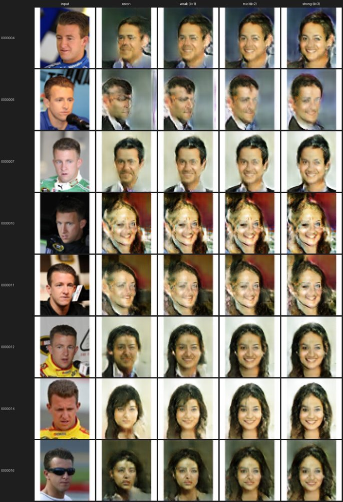
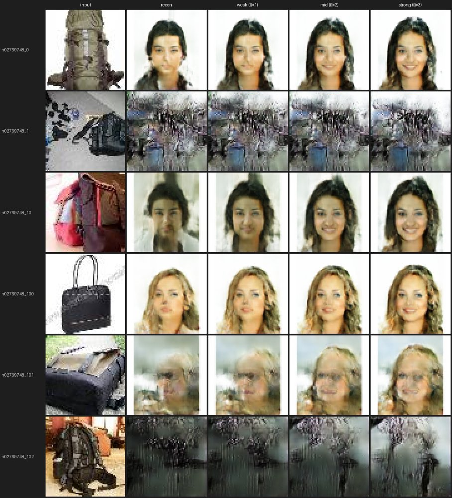
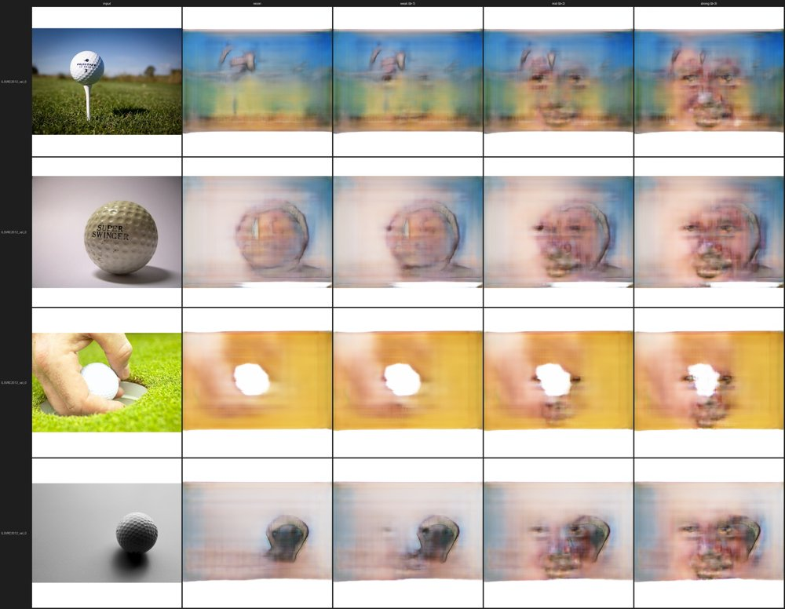
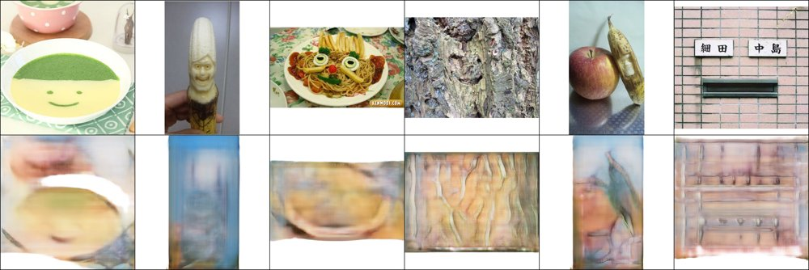
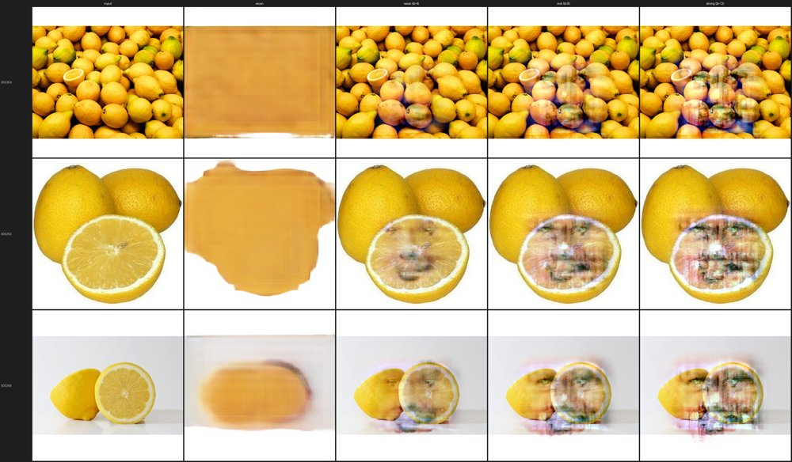

# VAEトラック 検証ログ

「ただの物体への笑顔付与」VAE担当([計画書](make_everything_smile_plan.md))の検証記録。
各検証の **条件 → 結果 → 結果の在処** を時系列でまとめる。

- コード: [vae/](../)、各runの厳密な設定は `vae/outputs/<run>/config.json`(学習時に自動保存)
- 結果画像の原本は `vae/outputs/<run>/`(gitignore・再生成可能)。本書には代表画像のみ [docs/assets/vae/](assets/vae/) に複製して掲載
- 環境: RTX 3070 Ti (8GB)、WSL2、uv管理(PyTorch cu124)

共通の手法: VAE-GAN(Larsen et al. 2016)を CelebA(笑顔/中立)＋物体画像で学習し、
潜在空間の **笑顔方向ベクトル**(笑顔群と中立群の潜在平均の差)で物体を編集する。

---

## 検証一覧(サマリ)

| # | run | 解像度 | 潜在 | 主眼 | 結論 |
|---|---|---|---|---|---|
| 1 | smoke64 | 64 | グローバル | 疎通(スモーク) | データ汚染で失敗→修正 |
| 2 | smoke64_v2 | 64 | グローバル256次元 | 笑顔編集の成立 | 編集は効くが物体が顔に崩壊 |
| 3 | smoke64_v3 | 64 | 空間8×8×64 | 物体保存・性別もつれ | 物体保存OK・男女別方向で改善 |
| 4 | hq512 (Baseline) | 512 | 空間16×16×64 | 高解像度・画質 | 顔は可・物体はぼやけ＆スケール不一致 |
| 5 | pareidolia512 (+Pareidolia) | 512 | 空間16×16×64 | FiT追加学習 | FiT方向は作れるが再構成精度が限界 |
| 6 | blend_demo | 512 | — | 物体保存(ピクセル合成) | 物体をシャープに保てる |
| 7 | fruit_demo | 512 | — | 単一物体への憑依 | 単一果物で笑顔が宿る(本命作例) |
| 8 | diffusion_compare | 512 | 空間16×16×64 | Diffusionと同一入力で比較 | 同一 crop で object→人間笑顔の連続遷移を再現 |
| 9 | pretrained_ae | 512 | SD-VAE潜在4×64×64 | 事前学習AEを土台に | シャープな再構成＋物体保存で笑顔が宿る |

---

## 1. smoke64 — 疎通スモーク(失敗→原因特定)

- **条件**: 64px、グローバル潜在、4000 step。データ = CelebA(笑顔/中立)＋ Tiny ImageNet 非生物物体。
- **結果**: 出力が雑なブロブにしかならず。原因は **Tiny ImageNet 展開キャッシュが物体フォルダ内に残り、全200クラス12万枚(動物含む)が学習に再帰混入** していたこと。意図した7千枚ではなかった。
- **在処**: `vae/outputs/smoke64/`(汚染下の旧結果)。修正はコミット `4afebe2`(キャッシュを `data/raw/_cache/` に分離)。

## 2. smoke64_v2 — 笑顔編集の成立とグローバル潜在の限界

- **条件**: 64px、グローバル潜在 z=256、20000 step、クリーンな7千枚。D学習率半減＋ラベルスムージングで安定化。
- **結果**: 笑顔方向は機能(顔で口角・歯が変化)。しかし **物体に方向を足すと物体が人間の顔そのものに置換**(物体保存ゼロ)、笑顔強化で **女性化**(性別もつれ)。
- **在処**: 顔サニティ [v2_faces_sanity.jpg](assets/vae/old/v2_faces_sanity.jpg) / 物体崩壊例 [v2_backpack_collapse.jpg](assets/vae/old/v2_backpack_collapse.jpg)。原本 `vae/outputs/smoke64_v2/edits/`。

## 3. smoke64_v3 — 空間潜在＋男女別方向

- **条件**: 64px、**空間潜在 8×8×64**、20000 step。CelebAを **笑顔/中立 × 男/女** の4分割でDLし、男女別に方向を計算して平均(性別もつれ対策)。設定: [vae/configs/smoke64.yaml](../configs/smoke64.yaml)。
- **結果**: 物体の構図・色が **保持されたまま** 編集できるようになった(グローバル潜在の崩壊が解消)。物体は顔より強いα が必要(顔1〜3 / 物体4〜12)で、αを上げると「物体のまま→顔がうっすら宿る→顔が支配的」と遷移。
- **在処**: 顔 [v3_faces_sanity.jpg](assets/vae/old/v3_faces_sanity.jpg) / アイス強度振り [v3_icecream.jpg](assets/vae/old/v3_icecream.jpg)。原本 `vae/outputs/smoke64_v3/edits/`。コミット `d005d6b`。

## 4. hq512 — 512px Baseline

- **条件**: **512px**、空間潜在 16×16×64、30000 step(189分)。AMP(混合精度)＋VGG perceptual loss、KL重み0.5。データ = CelebA-HQ(笑顔/中立×男女 各1000)＋ Imagenette 非生物8クラス。設定: [vae/configs/hq512.yaml](../configs/hq512.yaml)。
- **結果**: 顔の笑顔方向は512pxでも機能。一方 **物体はぼやけ、出てくる顔が物体とスケール不一致**(人間スケールの顔が貼り付く)、**輪郭まで一緒に乗る**。スクラッチVAE-GANを512px・約9千枚で学習する画質の天井に近い。
- **在処**: スケール不一致・輪郭リーク例 [hq512_golf_scale_contour.jpg](assets/vae/old/hq512_golf_scale_contour.jpg)。原本 `vae/outputs/hq512/edits/`。コミット `9dc30f0`。

## 5. pareidolia512 — +Pareidolia(Faces in Things 追加)

- **条件**: hq512から **微調整(warm-start)**、15000 step(102分)。Baselineデータ ＋ **Faces in Things の happy サブセット(1216枚)を4回オーバーサンプル(約35%)**。設定: [vae/configs/pareidolia512.yaml](../configs/pareidolia512.yaml)。
- **狙いと知見**: FiTを学習に入れ、編集方向も **`FiT-happy − 物体`** から作ると、「人間の顔」ではなく「顔に見える物体」へ押せる(スケール・輪郭が物体側に揃う)。
- **結果**: FiT方向は作れるが、**FiTは現モデルにとって学習量不足で再構成が崩れる**([hq512_fit_recon_ood.jpg](assets/vae/old/hq512_fit_recon_ood.jpg) は Baselineモデルでの再構成崩れ。微調整後も大きくは改善せず)。FiT風のくっきりした顔の手がかりを描く精度には未到達。
- **在処**: 原本 `vae/outputs/pareidolia512/`。コミット `d181a9e`。

## 6. blend_demo — ピクセル空間差分ブレンド(物体保存)

- **条件**: `edit.py --blend`。`出力 = 元画像 + 羽根付き目口マスク × (decode(z+方向) − decode(z))`。物体自身のシャープな画素を保ち、笑顔差分だけを目・口領域に物体スケールで重ねる。`--feature-only`(方向の空間平均=一様に顔へ寄る成分を除去)で輪郭リークを抑制。
- **結果**: **物体がシャープなまま保持**され、笑顔差分が局所的に乗る。スケール不一致・輪郭・物体保存崩壊を同時に緩和。
- **在処**: 例 [blend_gas_pump.jpg](assets/vae/old/blend_gas_pump.jpg)。原本 `vae/outputs/blend_demo/`。コミット `bbc0e06`。

## 7. fruit_demo — 単一物体(果物)への憑依【本命作例】

- **条件**: 単一で大きく写った物体(VinayHajare/Fruits-30)を編集キャンバスに。`--blend` で物体を保持しつつ、CelebA方向 / FiT方向の両方で笑顔差分を中央に重ねる。取得: [vae/scripts/download_objects_single.py](../scripts/download_objects_single.py)。
- **結果**: **単一果物(レモン半割り・リンゴ・アボカド等)で、果物をシャープに保ったまま中央に笑顔が宿る**。建物・シーンより圧倒的に向く(FiTのリンゴ/バッグ例と同じ構図)。CelebA方向のほうがFiT方向よりくっきり。高強度ではゴースト(VAEのぼやけ)が残る。
- **在処**: [fruit_lemons.jpg](assets/vae/old/fruit_lemons.jpg) / [fruit_apples.jpg](assets/vae/old/fruit_apples.jpg) / [fruit_avocados_fit.jpg](assets/vae/old/fruit_avocados_fit.jpg)。原本 `vae/outputs/fruit_demo/`。コミット `10514e5`。

## 8. diffusion_compare — Diffusion トラックとの同一条件比較

- **狙い**: Diffusion トラックが笑顔化した **FacesInThings のパレイドリア crop と同一 ID・同一プロトコル**(scale ラダー)で VAE-GAN の潜在編集を回し、手法間で並べて比較する。実装: [experiments/diffusion_compare/](../experiments/diffusion_compare/)(共有コア `smilevae` を再利用、追加学習なし)。
- **条件**: 共通10 ID(diffの `outputs/` compare 出力と crop キャッシュの積集合、[eval_ids.txt](../experiments/diffusion_compare/eval_ids.txt))。2条件とも **CelebA-HQ 笑顔方向**で揃え(§0.2 は学習データだけ変える)、α ラダー `0 4 8 12`。pareidolia512 用の笑顔方向は本比較のため新規算出(`proj_std≈21.1`)。
- **結果**: **両条件とも α を上げると object → 人間の笑顔へ連続遷移**(パレイドリア画像がそのまま人間顔になるのは高 α 側の想定結果)。Baseline(hq512)は年配男性寄り、+Pareidolia(pareidolia512)は別の笑顔顔＋歯の見え方が変化。crop が顔枠なので α=4 で既に顔が支配的、物体保存は両者とも弱い。全域で VAE 特有のボケ(diffusion のシャープさとの対比が比較の主眼)。
- **注意**: `fit_direction`(FiT-happy 方向)は pareidolia512 では **α≥4 で格子状ノイズに崩壊**(proj_std≈34 で過剰に押すため)。使う場合は α を `0 1 2 3` 程度に絞る。
- **在処**: 原本 `vae/outputs/diffusion_compare/{baseline,pareidolia}/`(gitignore・再生成可能)。各 ID の `<id>_compare.png`(input | α=0 | α=4 | α=8 | α=12)・`<id>_smile.png`・`_overview.png`。

## 9. pretrained_ae — 事前学習オートエンコーダ(SD-VAE)を土台に

- **狙い**: これまでのボケの原因は「VAE という手法族」ではなく「**画像を描く decoder をスクラッチ・小データで学習**」した点、という仮説を検証する。Diffusion トラックがシャープなのは笑顔を LoRA で少し足すだけで **SD-VAE(画像↔潜在の autoencoder)は事前学習済み・凍結**だから(`diffusion/configs/train_lora.yaml`)。同じ土台を VAE 側でも使い、潜在で笑顔方向を操作する。実装: [experiments/pretrained_ae/](../experiments/pretrained_ae/)。
- **条件**: **`stabilityai/sd-vae-ft-mse` を凍結**、512px(潜在 4×64×64)。笑顔方向は同じ CelebA-HQ 男女別ペア(各500枚)から算出(`proj_std≈118`)。編集 `z=encode(x); decode(z+α·proj_std·direction)`、α ラダー `0 1 2 3`。評価は diffusion_compare と同一10 ID。
- **結果**: **α=0 の再構成が完全にシャープ**で物体のテクスチャ・輪郭・色を忠実に保持(スクラッチ版は α=0 で既にボケ)。α を上げると **物体を保ったまま笑った口(歯)が局所的に宿り**、ワッフル/蒸しパン/木目などがそれぞれの見た目のまま笑顔化。**全体が人間に置換されない**(§8 スクラッチ版とは対照的)。→ 仮説どおり、事前学習 decoder を土台にすれば VAE 流の潜在編集でも「シャープ＋物体保存」が両立する。
- **在処**: 原本 `vae/outputs/pretrained_ae/compare/`(gitignore・再生成可能)。方向 `vae/outputs/pretrained_ae/smile_direction.pt`。
- **含意(比較の正確な位置づけ)**: 3手法比較で見えた差は「VAE vs Diffusion」ではなく、**事前学習の土台/凍結された事前学習 decoder の有無**が支配的。この実験はその交絡を切り分けるデータ点。
- **タスク定義の整合(重要)**: 初期は CelebA 人間の笑顔方向(`smile_direction`)を足していたため「物体に人の顔を重ねる」見え方だった。Diffusion は IP2P の画像条件つき編集で **FacesInThings 自体の neutral→happy**(`build_pairs_pareidria.py`)を学び「物体の顔そのものを笑わせる」。VAE 側も**同じ FacesInThings ドメインから方向を学ぶ**(`fit_direction` = happy−neutral, proj_std≈214)と、物体を保ったまま表情が happy 化し挙動が揃う。原本 `vae/outputs/pretrained_ae/compare_fit/`。
- **2段カスケード(顔化→人間笑顔)**: 「一度顔っぽくした画像を人間の笑顔ポリシーに再入力すれば笑顔が作りやすいのでは」という仮説を `cascade_smile.py`(生成画像を decode→再encode して次段へ)で検証。**仮説どおり α=2〜3 で歯を見せた明確な笑顔**になり、素の物体を直接笑わせるより強く出る。ただし**物体は人間の顔になりきる**(物体保存を失う)。`fit_direction`+`--keep-color`(物体を保ち控えめに笑う)と対で、「物体を残す↔笑顔を強くする」の2極を成す。原本 `vae/outputs/pretrained_ae/cascade/`。
- **「笑顔が同じ位置」対策(1) 入力アラインの実証**: 笑顔方向は整列 CelebA 由来の固定空間マップなので笑顔がフレーム中央の口の行に固定される。`align_crop.py` で FacesInThings の顔 box を使い顔を canonical フレーム(占有率≈62%・中央)へ正規化すると、**笑顔差分が各物体の顔領域下部(≈口)に一貫して載る**ようになる(入力が学習分布に近づく)。**ただし笑顔は依然フレーム内の同じ絶対位置**で、各物体の実際の口位置への追従はしない(ランドマーク無し=(2)不可、条件付き編集=(3)は範囲外)。位置適応は線形潜在編集の原理的頭打ち、と実データで確認。原本 `vae/outputs/pretrained_ae/low_celeba_kc_aligned/`。
- **軽量評価(10枚叩き台)**: `experiments/eval.py`(LPIPS/SSIM/CLIP)。CSV: `docs/assets/vae/results/vae_metrics_10img.csv`。**保存軸(LPIPS↓/SSIM↑/CLIP画像類似↑)は綺麗に機能**し順位が明確(low/aligned > fit_kc ≫ celeba_ladder > cascade > scratch)。笑顔を強く出す手法ほど保存が下がるトレードオフも数値化。**一方 CLIP-smile はほぼノイズ(±0.01)で、プラスになるのは人間化する手法だけ→自動の笑顔指標は人間化を報酬化し物体保存の笑顔を過小評価**。笑顔軸は人手評価(2AFC/MOS)が必須、と実データで確認(計画§0.1-5 と一致)。FID/KID は数百枚必要のため別途。
- **残る差と抑制**: `fit_direction` は α 増で暖色ドリフト(happy 群の色偏り)。VAE の「潜在に一律方向を足す」方式と Diffusion の「画像条件つき編集」の本質差。`compare_facesinthings.py --keep-color`(decode 後に輝度は編集後・色相彩度は入力へ戻す YCbCr 合成)または `--feature-only`(方向の空間平均=一律成分を除去)で抑制できる。**`--keep-color` で色ドリフトが消え、物体は元の色・形のまま自分の口が笑みのカーブになる**ことを確認(= Diffusion のタスク定義に最も近い出力)。原本 `vae/outputs/pretrained_ae/compare_fit_kc/`(keep-color)/ `compare_fit_both/`(両方掛け)。

---

## 総括と次の課題

- **達成**: VAE-GANで「物体を保ったまま笑顔を宿す」ことを、特に **単一・大写し物体** で実証。空間潜在化＋男女別方向＋ピクセルブレンドが効いた。
- **限界(率直に)**: スクラッチVAE-GANの512px再構成精度が天井。FiT風のくっきりしたパレイドリアには、FiTデータ拡充・物体中心クロップ・より長い学習が要る。VAE特有のぼやけ(計画書リスク4)の典型。
- **次の選択肢**: (1) 単一・白背景物体に絞った作例厳選、(2) FiT拡充＋再学習、(3) 現状をVAEの比較データ点として確定し3手法比較へ。
